# Supervision System

The SIDS supervision system provides real-time monitoring and visualization capabilities for your actor system. With the `visualize` feature enabled, you can track actor lifecycle events, message passing, and generate visualizations in multiple formats.

## Features

- **Real-time Metrics Collection**: Automatically tracks actor spawning, message processing, and shutdown events
- **Multiple Export Formats**: JSON, Graphviz DOT, and Mermaid diagram syntax
- **Event History**: Maintains a rolling window of recent events for each actor
- **Performance Tracking**: Measures uptime and message throughput
- **Status Monitoring**: Tracks actor status (Running, Stopped, Failed)

## Enabling Supervision

The supervision system is behind the `visualize` feature flag. Enable it in your `Cargo.toml`:

```toml
[dependencies]
sids = { version = "0.5.2", features = ["visualize"] }
```

Or run examples with:

```bash
cargo run --example supervision --features visualize
```

## Usage

### Basic Setup

```rust
use sids::actors::{start_actor_system_with_config, spawn_actor};
use sids::config::SidsConfig;

#[tokio::main]
async fn main() {
    let config = SidsConfig::default();
    let mut actor_system = start_actor_system_with_config(config);
    
    // Spawn your actors...
    spawn_actor(&mut actor_system, MyActor, Some("MyActor".to_string())).await;
    
    // Shutdown
    let _ = actor_system.shutdown().await;
}
```

### Accessing Supervision Data

Once actors are spawned, you can retrieve supervision data at any time:

```rust
#[cfg(feature = "visualize")]
{
    // Get the full supervision snapshot
    let supervision = actor_system.get_supervision_data();
    
    // Get summary statistics
    let summary = actor_system.get_supervision_summary();
    
    println!("Active actors: {}", summary.active_actors);
    println!("Total messages processed: {}", summary.total_messages_processed);
}
```

## Data Model

### SupervisionData

The `SupervisionData` struct contains:

- **timestamp**: Unix epoch milliseconds when the snapshot was taken
- **actors**: HashMap of actor ID → ActorMetrics
- **total_messages_processed**: Cumulative count across all actors
- **total_messages_sent**: Cumulative count across all actors

### ActorMetrics

Per-actor metrics include:

- **id**: Unique identifier (format: "actor-0", "actor-1", etc.)
- **actor_type**: Human-readable actor type name
- **status**: ActorStatus (Running, Stopped, Failed)
- **spawned_at**: Timestamp when actor was created
- **shut_down_at**: Timestamp when actor shut down (if applicable)
- **messages_processed**: Total messages received by the actor
- **messages_sent**: Total messages sent by the actor
- **recent_events**: Last 100 events (rolling window)
- **uptime_ms()**: Convenience method for uptime calculation

### Event Types

Tracked events include:

- **Spawned**: Actor was created
- **MessageProcessed**: Actor processed a message
- **MessageSent { recipient_id }**: Actor sent a message to another actor
- **Stopped**: Actor was instructed to stop
- **Failed { reason }**: Actor encountered an error
- **ShutDown**: Actor completed shutdown

## Export Formats

### JSON Export

Export supervision data as structured JSON:

```rust
#[cfg(feature = "visualize")]
use sids::supervision_export::to_json;

let supervision = actor_system.get_supervision_data();
match to_json(&supervision) {
    Ok(json_string) => println!("{}", json_string),
    Err(e) => eprintln!("Export failed: {}", e),
}
```

The JSON includes full actor metrics and event history, suitable for:

- REST API responses
- Long-term storage
- Machine-readable analysis
- Integration with monitoring systems

### Graphviz DOT Export

Generate Graphviz format for professional visualizations:

```rust
#[cfg(feature = "visualize")]
use sids::supervision_export::to_dot;

let supervision = actor_system.get_supervision_data();
let dot = to_dot(&supervision);

// Save to file
use std::fs;
fs::write("supervision.dot", &dot).expect("Failed to write file");
```

Render the DOT file:

```bash
# Generate SVG
dot -Tsvg supervision.dot -o supervision.svg

# Generate PNG
dot -Tpng supervision.dot -o supervision.png

# Generate PDF
dot -Tpdf supervision.dot -o supervision.pdf
```

Features:

- Color-coded nodes: 🟢 Running (lightgreen), 🟡 Stopped (lightyellow), 🔴 Failed (lightcoral)
- Message count labels on edges
- Left-to-right layout (rankdir=LR)

### Mermaid Diagram Export

Generate Mermaid syntax for ASCII-art style diagrams:

```rust
#[cfg(feature = "visualize")]
use sids::supervision_export::to_mermaid;

let supervision = actor_system.get_supervision_data();
let mermaid = to_mermaid(&supervision);
println!("{}", mermaid);
```

Paste the output into [Mermaid Live Editor](https://mermaid.live) or use with markdown:

````markdown

```mermaid
graph LR
  actor_0["🟢[actor-0]<br/>MyActor<br/>Msgs: 5"]
  actor_1["🟢[actor-1]<br/>OtherActor<br/>Msgs: 3"]
  actor_0 -->|2 msgs| actor_1
```

````

Features:

- Status emojis: 🟢 Running, 🟡 Stopped, 🔴 Failed
- Message count on relationships
- Compatible with GitHub, GitLab, and other Mermaid-supporting platforms

### Text Summary

Get a human-readable text summary:

```rust
#[cfg(feature = "visualize")]
use sids::supervision_export::to_text_summary;

let supervision = actor_system.get_supervision_data();
println!("{}", to_text_summary(&supervision));
```

Output:

```text
=== Actor System Summary ===
Timestamp: 1771968294413

Actors:
  Total: 3
  Running: 3
  Stopped: 0
  Failed: 0

Messages:
  Processed: 10
  Sent: 8
```

## Use Cases

### Development & Debugging

Monitor actor behavior during development:

```rust
let supervision = actor_system.get_supervision_data();
println!("{}", to_text_summary(&supervision));
```

### Monitoring Dashboards

Export to JSON and feed into monitoring systems:

```rust
let supervision = actor_system.get_supervision_data();
if let Ok(json) = to_json(&supervision) {
    // Send to monitoring/alerting system
    send_to_prometheus(&json)?;
}
```

### Documentation & Analysis

Generate DOT diagrams for documentation:

```rust
let dot = to_dot(&supervision);
fs::write("docs/actor-system.dot", dot)?;
// Commit to git for change tracking
```

### Live System Inspection

Build a web server that exposes supervision data:

```rust
#[get("/system/supervision")]
fn get_system_supervision(actor_system: State<ActorSystem>) -> Json<SupervisionData> {
    Json(actor_system.get_supervision_data())
}
```

## Example

Run the included example:

```bash
cargo run --example supervision --features visualize
```

This example demonstrates:

1. Creating an actor system
2. Spawning multiple actors
3. Extracting supervision data
4. Generating all export formats
5. Graceful shutdown

## Feature Flag Behavior

When the `visualize` feature is **disabled**:

- Supervision module is completely compiled out
- No runtime overhead
- ActorSystem works identically

When the `visualize` feature is **enabled**:

- Supervision data is collected automatically on every actor operation
- Methods like `get_supervision_data()` are available
- Export functions are available
- Minimal runtime overhead (HashMap lookups and event updates)

## Performance Considerations

- **Memory**: Stores last 100 events per actor; negligible for typical systems
- **CPU**: HashMap lookups for event recording; <1% overhead in most cases
- **Storage**: JSON export is typically <10KB per 100 actors

For systems with thousands of actors, consider:

- Periodic sampling instead of continuous collection
- Exporting to external storage (database, time-series DB)
- Filtering events before export

## Limitations & Future Work

Current limitations:

- Single crate view (no cross-crate actor visibility)
- Event history limited to 100 recent events per actor
- No statistical analysis functions

Potential future enhancements:

- Custom metrics collection
- Time-series export (InfluxDB, Prometheus formats)
- Automated anomaly detection
- Historical trending
- Interactive visualization server
