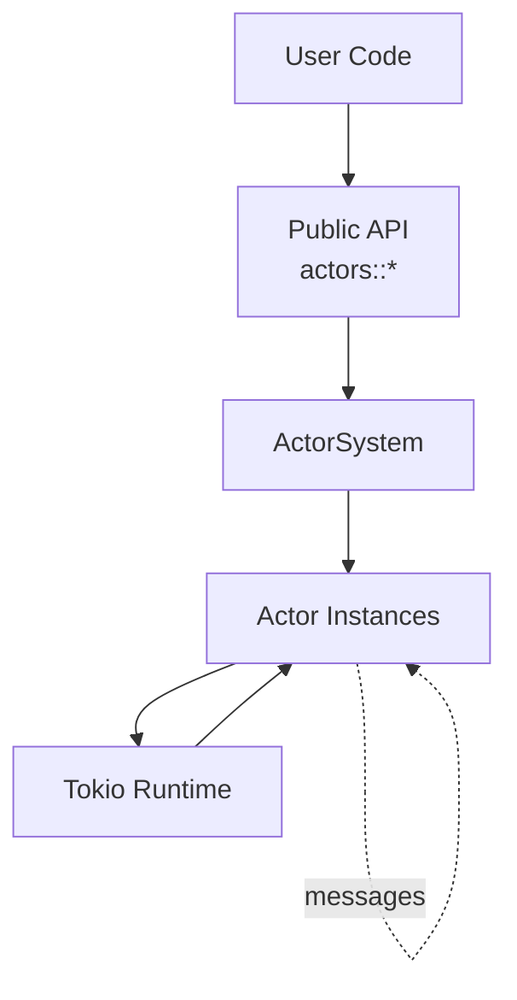

# SIDS Architecture Documentation

This directory contains comprehensive architecture documentation for SIDS v1.0.0.

## Overview

SIDS (Simple Implementation of a Distributed System) is an actor-based concurrency framework for Rust.
It provides a message-passing architecture with isolated, concurrent actors.

## Architecture Documents

- **[system-overview.md](system-overview.md)** - High-level system architecture and components
- **[message-flow.md](message-flow.md)** - Message passing and communication patterns
- **[actor-lifecycle.md](actor-lifecycle.md)** - Actor lifecycle from spawn to termination
- **[streaming-architecture.md](streaming-architecture.md)** - Streaming module architecture (Source/Flow/Sink)
- **[actor-critic-pattern.md](actor-critic-pattern.md)** - Example: Machine learning with actors

## Key Concepts

### Actor System

The `ActorSystem<MType, Response>` is the central coordinator that manages:

- Actor registration and lifecycle
- Message routing
- Channel management
- System monitoring

### Actors

Actors implement the `Actor<MType, Response>` trait:

- Isolated state (no shared memory)
- Asynchronous message processing
- Can spawn other actors
- Communicate only via messages

### Messages

Messages are envelopes containing:

- **Payload**: User-defined data (`MType`)
- **Response Handler**: Optional callback for responses
- **Stop Signal**: Flag to terminate actor
- **Blocking Flag**: Hint for synchronous processing

### Response Types

Actors can respond using:

- **ResponseHandler**: Trait-based response pattern (recommended)
- **Oneshot Channels**: Direct response channels
- **Blocking Channels**: Synchronous response channels

## Design Principles

1. **Isolation**: No shared mutable state between actors
2. **Message Passing**: All communication through messages
3. **Asynchronous**: Built on Tokio async runtime
4. **Type Safety**: Leverages Rust's type system
5. **Error Handling**: Result types throughout
6. **Memory Safety**: Automatic cleanup with RAII

## System Boundaries



## Module Structure

```text
sids/
├── actors/          # Core actor system (stable)
│   ├── actor.rs            # Actor trait
│   ├── actor_system.rs     # System coordinator
│   ├── actor_ref.rs        # Actor references
│   ├── messages.rs         # Message types
│   └── response_handler.rs # Response patterns
├── streaming/       # Reactive streams (stable)
│   ├── source.rs           # Data sources
│   ├── flow.rs             # Transformations
│   ├── sink.rs             # Data consumers
│   └── materializer.rs     # Execution
└── supervision/     # Visualization (experimental)
    └── ...
```

## Performance Characteristics

- **Actor Spawn**: ~5-20 μs per actor
- **Message Passing**: ~2-10 μs per message
- **Concurrent Messaging**: Scales linearly with cores
- **Memory**: ~KB per actor (depends on state)

See [CONTRIBUTING.md](../CONTRIBUTING.md) for benchmark details.

## Diagrams

All diagrams use Mermaid for rendering. View these files in a Markdown viewer that supports
Mermaid (GitHub, VS Code with extensions, etc.) for best experience.

## Version

These documents reflect SIDS **v1.0.0** architecture.

For historical architecture, see git history. Significant changes from earlier versions:

- Removed Officer/Courier abstraction (v0.x)
- Direct ActorSystem management
- Simplified message routing
- Added actor management APIs (v0.8.0+)
- Stabilized streaming module (v1.0.0)

## Contributing

When updating architecture docs:

- Keep diagrams synchronized with code
- Use Mermaid for all diagrams
- Include code examples where relevant
- Follow markdown linting rules
- Update this README when adding new docs
