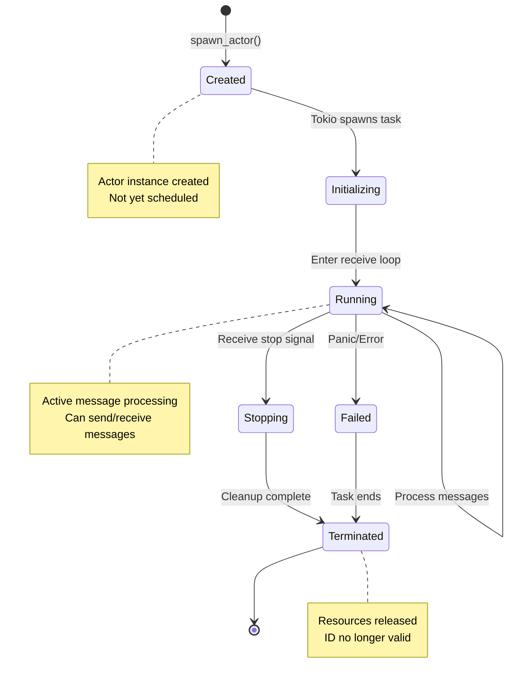
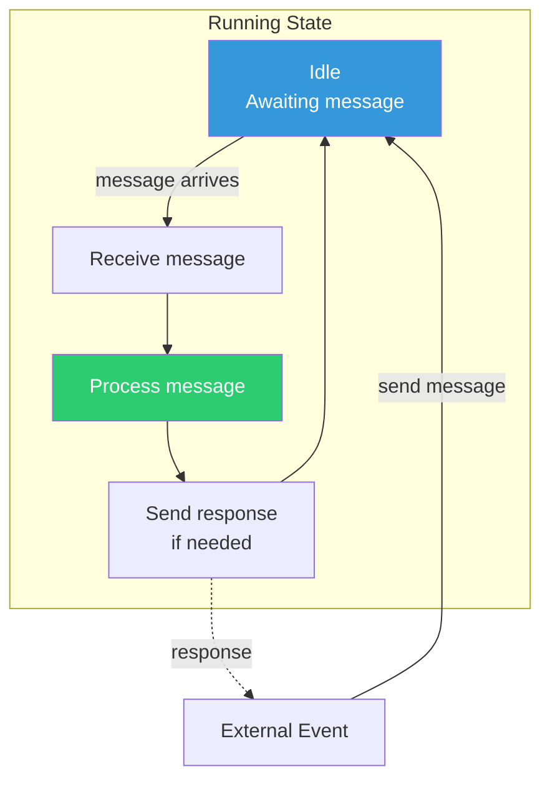
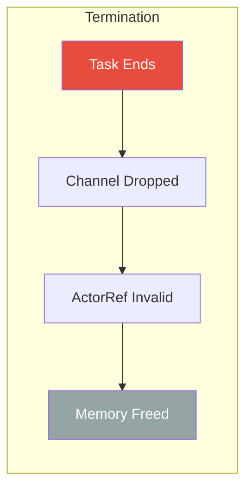
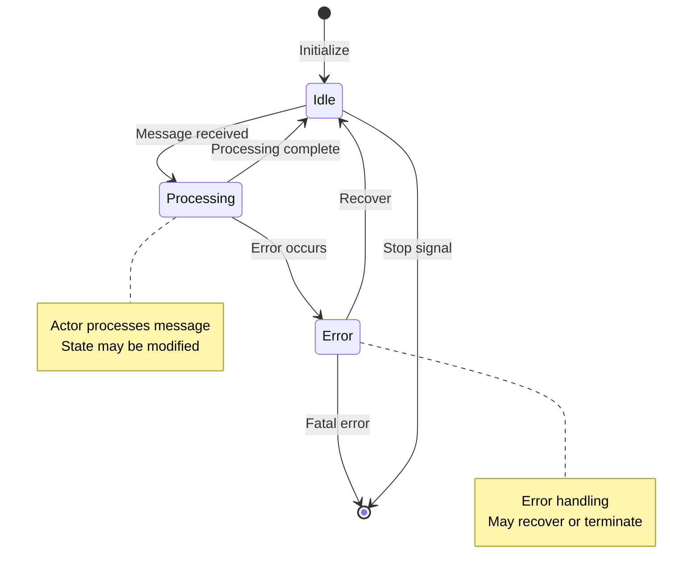

# Actor Lifecycle

This document describes the complete lifecycle of an actor in SIDS, from creation to termination.

## Lifecycle States



## Lifecycle Stages

### 1. Creation

Actor is instantiated but not yet running.

```mermaid
sequenceDiagram
    participant User
    participant API as spawn_actor
    participant System as ActorSystem
    participant Actor as Actor Instance

    User->>API: spawn_actor(system, actor, name)
    API->>System: Prepare for spawn
    System->>System: Generate actor ID
    System->>System: Create channel
    System->>Actor: Instantiate actor
    Note over Actor: State: Created
    System-->>User: Prepare complete
```

**Code:**

```rust
let my_actor = MyActor::new();
spawn_actor(&mut actor_system, my_actor, Some("my_actor".into())).await;
```

**What Happens:**

- User creates actor instance
- System assigns unique ID
- Channel created (default buffer: 100)
- Actor not yet processing messages

### 2. Initialization

System registers actor and spawns async task.

```mermaid
sequenceDiagram
    participant System as ActorSystem
    participant Runtime as Tokio Runtime
    participant Actor as Actor Task
    participant Registry as Actor Registry

    System->>Runtime: tokio::spawn(async { ... })
    Runtime->>Actor: Start task
    Actor->>Actor: Begin receive loop
    Note over Actor: State: Initializing
    System->>Registry: Insert ActorRef
    System->>Registry: Map name -> ID
    Note over Actor: State: Running
```

**Code (Internal):**

```rust
// Simplified internal implementation
let (sender, mut receiver) = mpsc::channel(buffer_size);
let actor_ref = ActorRef::new(sender, actor_id);

tokio::spawn(async move {
    while let Some(message) = receiver.recv().await {
        actor.receive(message).await;
        
        if message.stop {
            break;
        }
    }
});
```

**What Happens:**

- Tokio schedules actor task
- Receive loop begins
- ActorRef stored in registry
- Name mapped to ID (if provided)
- Actor ready for messages

### 3. Running

Actor actively processes messages from its channel.



**Message Processing Loop:**

```rust
impl Actor<MyMessage, ResponseMessage> for MyActor {
    async fn receive(&mut self, message: Message<MyMessage, ResponseMessage>) {
        // 1. Extract payload
        if let Some(payload) = message.payload {
            // 2. Process based on message type
            match payload {
                MyMessage::DoWork(data) => {
                    let result = self.do_work(data).await;
                    
                    // 3. Send response if requested
                    if let Some(responder) = message.responder {
                        responder.handle(ResponseMessage::Success).await;
                    }
                }
                MyMessage::GetState => {
                    if let Some(responder) = message.responder {
                        responder.handle(ResponseMessage::State(self.state.clone())).await;
                    }
                }
            }
        }

        // 4. Check stop signal
        if message.stop {
            self.cleanup().await;
            // Loop will exit
        }
    }
}
```

**Characteristics:**

- Non-blocking (async/await)
- Sequential message processing
- Isolated state (no shared memory)
- Can spawn other actors
- Can send messages to other actors

### 4. Stopping

Actor receives termination signal and prepares to exit.

```mermaid
sequenceDiagram
    participant Sender
    participant System
    participant Actor
    participant Runtime

    Sender->>System: stop_actor(actor_id)
    System->>Actor: Send stop message
    Note over Actor: message.stop = true
    Actor->>Actor: Process stop message
    Actor->>Actor: cleanup()
    Actor->>Actor: Exit receive loop
    Runtime->>Runtime: Task completes
    Note over Actor: State: Terminated
```

**Graceful Shutdown:**

```rust
// Stop specific actor
actors::stop_actor(&mut actor_system, actor_id).await?;

// Actor receives message with stop=true
impl Actor<M, R> for MyActor {
    async fn receive(&mut self, message: Message<M, R>) {
        if message.stop {
            // Cleanup resources
            self.db_connection.close().await;
            self.file_handle.flush().await;
            
            // Save state if needed
            self.persist_state().await;
            
            // Log shutdown
            info!("Actor {} shutting down", self.name);
            
            // Return - loop will exit
            return;
        }
        
        // Normal processing...
    }
}
```

**What Happens:**

- Stop message sent to actor
- Actor processes final cleanup
- Receive loop exits
- Task completes
- Resources released

### 5. Termination

Actor task has completed, resources cleaned up.



**Post-Termination:**

```rust
// After actor stops, ActorRef still exists in registry
let result = send_message_by_id(&mut actor_system, actor_id, msg).await;

match result {
    Err(ActorError::SendError(_)) => {
        // Channel closed - actor terminated
        println!("Actor no longer exists");
    }
    Ok(()) => {
        // Message sent successfully
    }
    _ => {}
}

// Optional: Remove from registry
// (Currently manual, could add remove_actor API)
```

**Characteristics:**

- ActorRef may still exist in registry
- Sends to terminated actors fail
- Memory reclaimed by Rust
- ID can be reused (if registry cleaned)

## Actor Creation Patterns

### Simple Actor

```rust
struct SimpleActor {
    count: u32,
}

impl Actor<String, ResponseMessage> for SimpleActor {
    async fn receive(&mut self, message: Message<String, ResponseMessage>) {
        if let Some(text) = message.payload {
            self.count += 1;
            println!("Message {}: {}", self.count, text);
        }
    }
}

// Spawn
let actor = SimpleActor { count: 0 };
spawn_actor(&mut system, actor, Some("simple".into())).await;
```

### Stateful Actor with Dependencies

```rust
struct DatabaseActor {
    connection: DbConnection,
    cache: HashMap<String, Value>,
}

impl DatabaseActor {
    async fn new(db_url: &str) -> Result<Self, DbError> {
        let connection = DbConnection::connect(db_url).await?;
        Ok(Self {
            connection,
            cache: HashMap::new(),
        })
    }
}

// Spawn with initialization
let actor = DatabaseActor::new("postgres://localhost").await?;
spawn_actor(&mut system, actor, Some("database".into())).await;
```

### Actor Factory Pattern

```rust
struct WorkerFactory;

impl WorkerFactory {
    async fn spawn_workers(
        system: &mut ActorSystem<WorkMsg, ResponseMessage>,
        count: usize,
    ) -> Vec<u32> {
        let mut worker_ids = Vec::new();
        
        for i in 0..count {
            let worker = Worker::new(i);
            spawn_actor(system, worker, Some(format!("worker-{}", i))).await;
            
            let id = find_actor_by_name(system, &format!("worker-{}", i))
                .expect("Just spawned");
            worker_ids.push(id);
        }
        
        worker_ids
    }
}

// Use factory
let worker_ids = WorkerFactory::spawn_workers(&mut system, 10).await;
```

## Actor Termination Patterns

### Graceful Shutdown

```rust
impl Actor<Command, ResponseMessage> for Worker {
    async fn receive(&mut self, message: Message<Command, ResponseMessage>) {
        if message.stop {
            // Finish pending work
            for task in &self.pending_tasks {
                self.complete_task(task).await;
            }
            
            // Notify others
            self.notify_supervisor("Shutting down").await;
            
            // Cleanup
            self.cleanup().await;
            return;
        }
        
        // Normal processing
    }
}
```

### Supervision Pattern

```rust
struct Supervisor {
    worker_ids: Vec<u32>,
    restart_count: HashMap<u32, u32>,
}

impl Supervisor {
    async fn check_worker_health(&mut self, system: &ActorSystem<M, R>, worker_id: u32) -> bool {
        let (handler, rx) = get_response_handler();
        let msg = Message {
            payload: Some(Command::Ping),
            stop: false,
            responder: Some(handler),
            blocking: None,
        };
        
        match send_message_by_id(system, worker_id, msg).await {
            Ok(()) => {
                // Wait for response with timeout
                match tokio::time::timeout(Duration::from_secs(5), rx).await {
                    Ok(Ok(_)) => true,  // Worker healthy
                    _ => false,         // Worker dead/unresponsive
                }
            }
            Err(_) => false,  // Send failed - worker dead
        }
    }
    
    async fn restart_worker(&mut self, system: &mut ActorSystem<M, R>, worker_id: u32) {
        let count = self.restart_count.entry(worker_id).or_insert(0);
        
        if *count < 3 {
            *count += 1;
            info!("Restarting worker {} (attempt {})", worker_id, count);
            
            let worker = Worker::new(worker_id as usize);
            spawn_actor(system, worker, Some(format!("worker-{}", worker_id))).await;
        } else {
            error!("Worker {} failed too many times, giving up", worker_id);
        }
    }
}
```

### Clean System Shutdown

```rust
async fn shutdown_system(system: &mut ActorSystem<M, R>) -> Result<(), ActorError> {
    info!("Initiating system shutdown");
    
    // Get all actors
    let actors = list_actors(system);
    
    // Stop all non-guardian actors
    for (id, name) in actors {
        if id == 0 {
            continue;  // Skip guardian
        }
        
        info!("Stopping actor {}: {}", id, name);
        stop_actor(system, id).await?;
    }
    
    // Wait for actors to finish
    tokio::time::sleep(Duration::from_millis(100)).await;
    
    // Stop guardian last
    stop_actor(system, 0).await?;
    
    info!("System shutdown complete");
    Ok(())
}
```

## Actor State Management

### State Transitions



### State Example

```rust
enum WorkerState {
    Idle,
    Processing { task_id: u64, started_at: Instant },
    Error { error: String, retry_count: u32 },
}

struct StatefulWorker {
    state: WorkerState,
    completed_tasks: u64,
}

impl Actor<WorkerMsg, ResponseMessage> for StatefulWorker {
    async fn receive(&mut self, message: Message<WorkerMsg, ResponseMessage>) {
        match (&self.state, message.payload) {
            (WorkerState::Idle, Some(WorkerMsg::StartTask(id))) => {
                self.state = WorkerState::Processing {
                    task_id: id,
                    started_at: Instant::now(),
                };
                // Process task...
            }
            (WorkerState::Processing { task_id, .. }, Some(WorkerMsg::CompleteTask)) => {
                self.completed_tasks += 1;
                self.state = WorkerState::Idle;
            }
            (_, Some(WorkerMsg::GetStatus)) => {
                if let Some(responder) = message.responder {
                    let status = self.get_status();
                    responder.handle(ResponseMessage::Status(status)).await;
                }
            }
            _ => {
                // Invalid state transition
                warn!("Invalid message for current state");
            }
        }
    }
}
```

## Lifecycle Hooks (Pattern)

While SIDS doesn't have built-in lifecycle hooks, you can implement them:

```rust
trait LifecycleHooks {
    async fn on_start(&mut self) {}
    async fn on_stop(&mut self) {}
    async fn on_error(&mut self, error: &str) {}
}

struct HookedActor {
    // ... fields
}

impl LifecycleHooks for HookedActor {
    async fn on_start(&mut self) {
        info!("Actor starting up");
        self.initialize_resources().await;
    }
    
    async fn on_stop(&mut self) {
        info!("Actor shutting down");
        self.cleanup_resources().await;
    }
    
    async fn on_error(&mut self, error: &str) {
        error!("Actor error: {}", error);
        self.log_error(error).await;
    }
}

impl Actor<M, R> for HookedActor {
    async fn receive(&mut self, message: Message<M, R>) {
        // First message - call on_start
        static STARTED: AtomicBool = AtomicBool::new(false);
        if !STARTED.swap(true, Ordering::SeqCst) {
            self.on_start().await;
        }
        
        if message.stop {
            self.on_stop().await;
            return;
        }
        
        // Normal processing with error handling
        if let Err(e) = self.process(message).await {
            self.on_error(&e).await;
        }
    }
}
```

## Performance Considerations

### Actor Spawn Cost

```rust
// Benchmark results (approximate)
// Actor spawn: ~5-20 μs per actor
// Includes: ID generation, channel creation, task spawn, registry insert

// For bulk spawning, spawn concurrently:
let spawns: Vec<_> = (0..1000)
    .map(|i| {
        let actor = Worker::new(i);
        spawn_actor(&mut system, actor, Some(format!("worker-{}", i)))
    })
    .collect();

tokio::join_all(spawns).await;
```

### Memory Per Actor

- **Fixed**: ~1-2 KB (channel, task state)
- **Variable**: Actor state size
- **Channel buffer**: `buffer_size * sizeof(Message<M, R>)`

### Task Scheduling

- Tokio uses work-stealing scheduler
- Actors are regular async tasks
- Fair scheduling among actors
- CPU-bound work should `yield_now()` periodically

## Best Practices

1. **Keep state small** - Large state = higher memory usage
2. **Async cleanup** - Don't block in stop handler
3. **Handle stop signal** - Always check `message.stop`
4. **Avoid panics** - Use Result types, handle errors
5. **Resource cleanup** - Close connections, flush buffers
6. **Spawn patterns** - Use factories for related actors
7. **Monitor health** - Implement ping/health checks
8. **Graceful shutdown** - Finish work before stopping
9. **State machines** - Use enums for complex states
10. **Lifecycle hooks** - Implement initialization/cleanup patterns

## Next Steps

- See [streaming-architecture.md](streaming-architecture.md) for reactive stream actors
- See [actor-critic-pattern.md](actor-critic-pattern.md) for coordinated actor patterns
- See [message-flow.md](message-flow.md) for communication patterns
