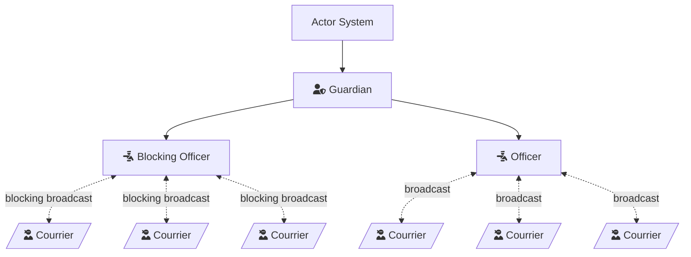

<link
  href="https://cdnjs.cloudflare.com/ajax/libs/font-awesome/6.5.1/css/all.min.css"
  rel="stylesheet"
/>

# Architecture

## Purpose

The purpose of this library is to provide a basic actor system approach to allow for reasonable customization of actor behavior
while avoiding some of the pitfalls with Rust's ownership
paradigm and potential memory leaks and race conditions that occur in concurrent systems. It is not intended to be a framework, but instead to illustrate what is necessary to get an actor system developed in Rust.

So far, our actor approach involves three necessary structures, with one experimental one. The necessary structures are as follows:

- The `ActorSystem` that acts as a controller for interaction with the Actors.
- A `Guardian` actor responsible for adding and removing actors and dealing with any problems that occur. The guardian hosts a number of Officers, explained in the next bullet.
- Any number of `Officers` and a subset called `BlockingOfficer` that contain an `ActorRef` that sends messages to an Actor and optionally a list of `Courriers` whose state can be updated based on events sent to the system.

Currently, the state-updating `Courriers` have not been implemented because they may be a solution to a problem that does not exist.

## Officer Structure

Officers have two roles:

1 - They can adapt the behavior of any actor, thereby becoming an actor themselves.
2 - They can perform update actions that send messages to all courrier actors under their control.

## Message Structure

1. `GuardianMessage` - Messages sent to the Guardian to request performance of system-oriented actions like adding and removing officers from the system.

2. Messages - Messages for communicating to Officers (and Courriers when implemented).

3. ResponseMessages - ResponseMessages are the only valid message to respond to another actor. These are "oneshot" messages to avoid race conditions among various other actors.