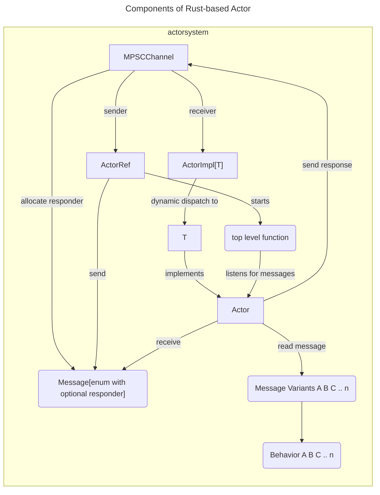

```mermaid
---
title: Components of Rust-based Actor
---


flowchart LR
    subgraph actorsystem
    MPSCChannel -- sender ---> ActorRef
    MPSCChannel -- receiver ---> ActorImpl["ActorImpl[T]"]
    MPSCChannel -- allocate responder ---> Message
    T -- implements --> Actor
    ActorImpl -- dynamic dispatch to --> T
    EventListenerMethod(top level function) -- listens for messages --> Actor
    ActorRef -- starts --> EventListenerMethod
    ActorRef -- send --> Message("Message[enum with optional responder]")
    Actor -- receive --> Message
    Actor -- read message --> MV("Message Variants A B C .. n") --> Behavior("Behavior A B C .. n")
    Actor -- send response --> MPSCChannel
    end


```