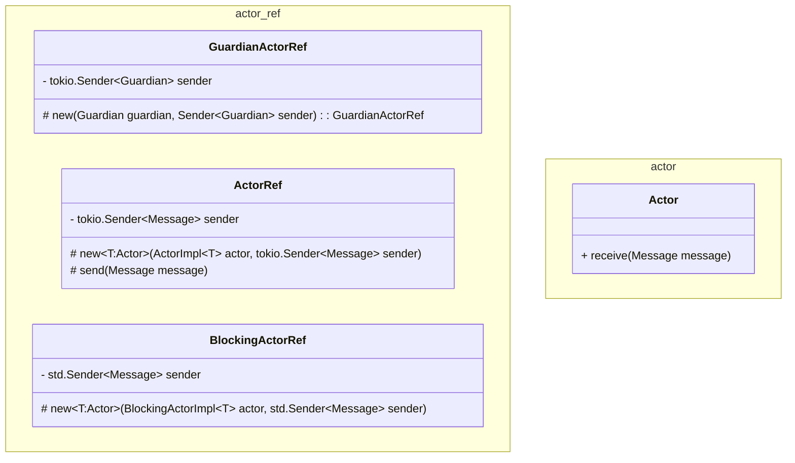

# Project Architecture

```mermaid

classDiagram

    namespace actor_ref {
        class GuardianActorRef {
            - tokio.Sender~Guardian~ sender
            # new(Guardian guardian, Sender~Guardian~ sender) : GuardianActorRef


        }
        class ActorRef {
            - tokio.Sender~Message~ sender
            # new~T:Actor~(ActorImpl~T~ actor, tokio.Sender~Message~ sender)
            # send(Message message)
        }

        class BlockingActorRef {
            - std.Sender~Message~ sender
            # new~T:Actor~(BlockingActorImpl~T~ actor, std.Sender~Message~ sender )
        }
    
    }

    namespace actor {
        class Actor {
            + receive(Message message)
        }


    }


```
