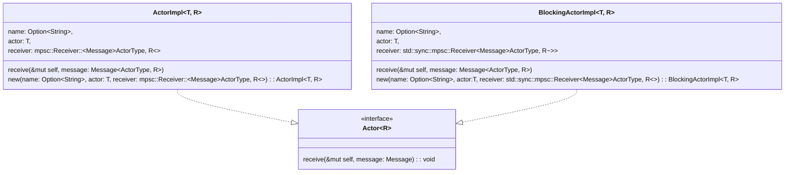

```mermaid

classDiagram 
    class Actor ~R~ {
        receive(&mut self, message: Message<ActorType, R>) : void
    }
    <<interface>> Actor

    class ActorImpl ~T, R~ {
        name: Option~String~,
        actor: T, 
        receiver: mpsc::Receiver::~Message~ActorType, R~~

        receive(&mut self, message: Message~ActorType, R~)
        new(name: Option~String~, actor: T, receiver: mpsc::Receiver::~Message~ActorType, R~~): ActorImpl~T, R~
    }
    class BlockingActorImpl ~T, R~ {
        name: Option~String~, 
        actor: T,
        receiver: std::sync::mpsc::Receiver~Message~ActorType, R~>>

        receive(&mut self, message: Message~ActorType, R~)
        new(name: Option~String~, actor:T, receiver: std::sync::mpsc::Receiver~Message~ActorType, R~~): BlockingActorImpl~T, R~
    
    }

    ActorImpl ..|> Actor
    BlockingActorImpl ..|> Actor


```