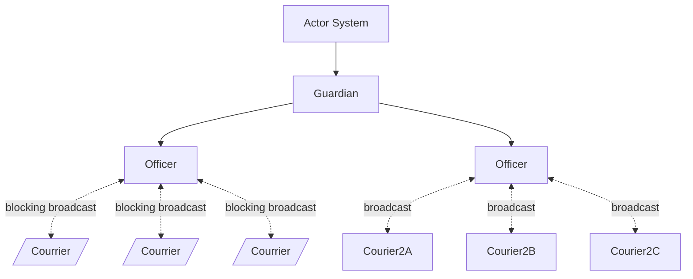

# Emissary Architecture

## Purpose

The purpose of an emissary architecture is to combine Observer-like patterns inside Actor-Model architecture. Through this approach, we have different actor types. 

At the top of the hierarchy is the **Guardian** which is and ActorSystem responsible for appropriate handling of the overall system. In general, it has the power to send broadcasts to all actors and destroy the system in the order it desires. No other actor can send a message to the Guardian, except to reply to a message sent by the Guardian.

Beneath each Guardian is the Officer which is an actor System with a domain of operation. Officers act as the publisher for a set of Actors in a system.

Inside the domain of the Officer are a vector of couriers set to perform specific tasks. Couriers cannot spawn actors. There are two types of courriers: blocking and non-blocking. Blocking courriers prevent access to the thread they are using while handling a message. Courrier actors can only reply to their officer.

Non-blocking courriers use the Tokio library to handle sequencing and backpressure

## Officer Structure

Officers have two roles:

1 - They can adapt the behavior of any actor, thereby becoming an actor themselves.
2 - They can perform update actions that send messages to all courrier actors under their control.

