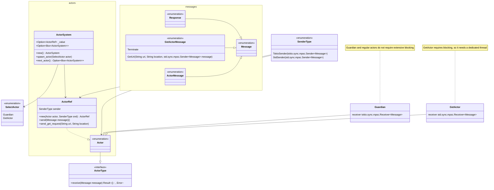

# Project Architecture

```mermaid

classDiagram

    namespace actors {
        class ActorSystem
        class Actor
        class ActorRef
    }

    namespace messages {
        class Message
        class ActorMessage
        class Response
        class GetActorMessage
    }

    class SelectActor
    <<enumeration>> SelectActor
    SelectActor : Guardian
    SelectActor : GetActor

    
    ActorSystem : +Option~ActorRef~ _value
    ActorSystem : +Option~Box~ActorSystem~~
    ActorSystem : +new() ActorSystem
    ActorSystem : +spawn_actor(SelectActor actor)
    ActorSystem : +next_actor() Option~Box~ActorSystem~~
    ActorSystem --> SelectActor

    ActorSystem --> ActorRef

    class ActorType
    <<interface>> ActorType
    ActorType : +receive(Message message) Result~(), Error~
    class Guardian
    Guardian : receiver tokio.sync.mpsc.Receiver~Message~
    note for Guardian "Guardian and regular actors do not require extensive blocking"
    class GetActor
    GetActor : receiver std.sync.mpsc.Receiver~Message~
    note for GetActor "GetActor requires blocking, so it needs a dedicated thread"
    

    class SenderType
    <<enumeration>> SenderType
    SenderType : TokioSender(tokio.sync.mpsc.Sender~Message~)
    SenderType : StdSender(std.sync.mpsc.Sender~Message~)

    

    

    <<enumeration>> Actor
    Actor --|> ActorType
    Guardian --|> Actor
    GetActor --|> Actor
    ActorRef : SenderType sender
    ActorRef : +new(Actor actor, SenderType snd) ActorRef
    ActorRef : +send(Message message) ()
    ActorRef : +send_get_request(String uri, String location)

    ActorRef ..|> Actor
    SenderType --> ActorRef
    SenderType --> Actor

    
    <<enumeration>> GetActorMessage
    <<enumeration>> Message
    <<enumeration>> ActorMessage
    <<enumeration>> Response
    GetActorMessage : Terminate
    GetActorMessage : GetUri( String uri, String location, std.sync.mpsc.Sender~Message~ message)
    Response --|> Message
    GetActorMessage --|> Message
    ActorMessage --|> Message


```
