# Message Flow Architecture

This document details how messages flow through the SIDS actor system, including patterns and best practices.

## Core Message Flow

### Basic Message Passing

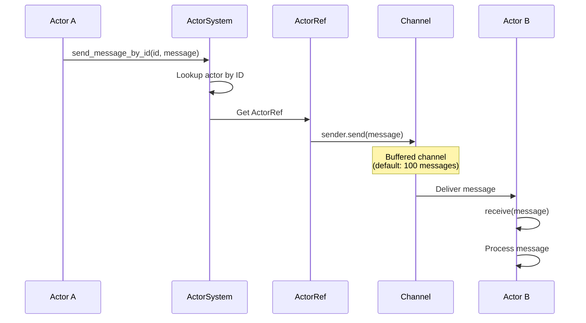

### Message Structure

```rust
pub struct Message<MType, Response> {
    pub payload: Option<MType>,              // User data
    pub stop: bool,                          // Termination signal
    pub responder: Option<BoxedResponseHandler<Response>>,  // Response callback
    pub blocking: Option<()>,                // Sync hint
}
```

## Message Patterns

### 1. Fire-and-Forget

No response expected, fastest pattern.

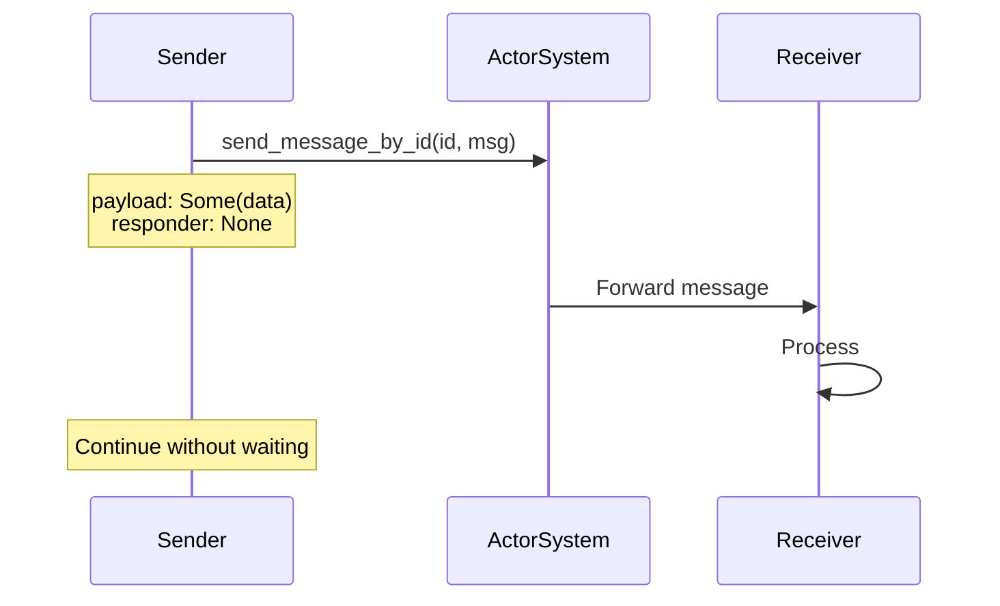

**Code Example:**

```rust
let msg = Message {
    payload: Some(MyData::new()),
    stop: false,
    responder: None,
    blocking: None,
};

send_message_by_id(&mut actor_system, actor_id, msg).await?;
// Continue immediately
```

**Use Cases:**

- Logging
- Notifications
- Background tasks
- Non-critical operations

### 2. Request-Response

Sender waits for response.

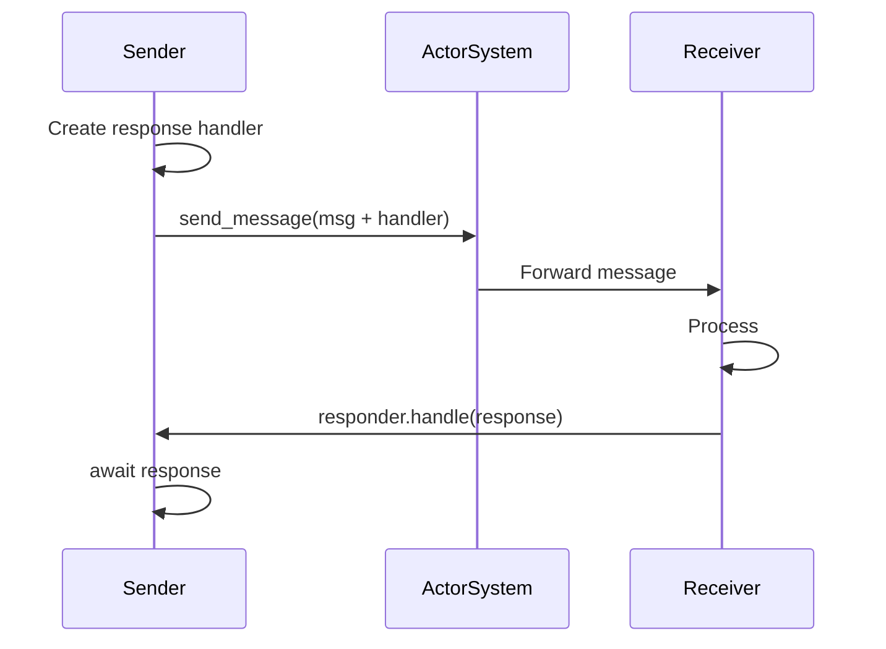

**Code Example:**

```rust
// Create response handler
let (handler, rx) = get_response_handler::<ResponseMessage>();

let msg = Message {
    payload: Some(Query::GetData),
    stop: false,
    responder: Some(handler),
    blocking: None,
};

send_message_by_id(&mut actor_system, actor_id, msg).await?;

// Wait for response
let response = rx.await?;
match response {
    ResponseMessage::Data(d) => println!("Got: {:?}", d),
    ResponseMessage::Error(e) => eprintln!("Error: {}", e),
    _ => {}
}
```

**Use Cases:**

- Query operations
- Validation requests
- Configuration retrieval
- State inquiries

### 3. Broadcast

One sender, multiple receivers.

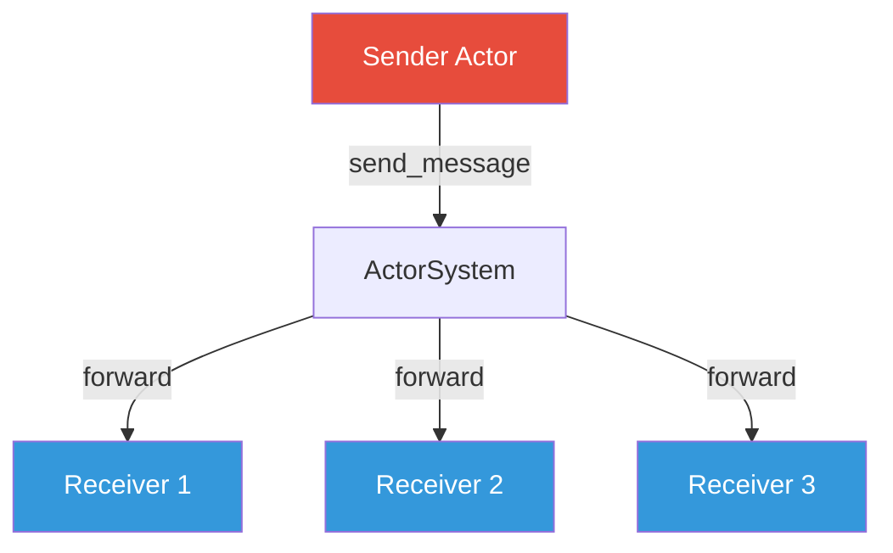

**Code Example:**

```rust
// Get all actor IDs
let actors = list_actors(&actor_system);

// Send to all
for (id, _name) in actors {
    let msg = Message {
        payload: Some(BroadcastData::Announcement("System update")),
        stop: false,
        responder: None,
        blocking: None,
    };
    send_message_by_id(&mut actor_system, id, msg).await?;
}
```

**Use Cases:**

- System announcements
- Configuration updates
- Event notifications
- Shutdown signals

### 4. Pipeline (Chain)

Sequential processing through multiple actors.

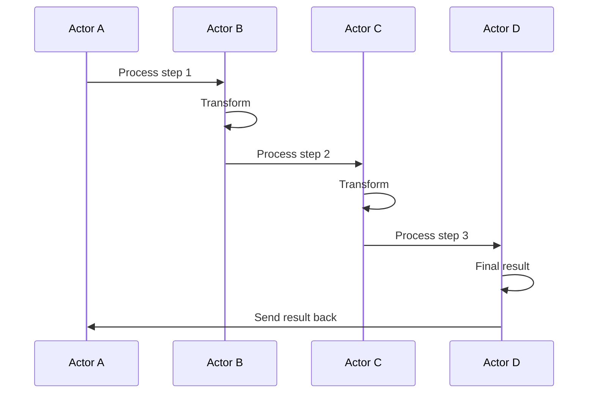

**Code Example:**

```rust
// Each actor forwards to next
impl Actor<PipelineMsg, ResponseMessage> for ProcessorA {
    async fn receive(&mut self, message: Message<PipelineMsg, ResponseMessage>) {
        if let Some(data) = message.payload {
            // Process
            let transformed = self.process(data);
            
            // Forward to next actor
            let next_msg = Message {
                payload: Some(transformed),
                stop: false,
                responder: message.responder,  // Pass along responder
                blocking: None,
            };
            send_message_by_id(&mut self.system, self.next_actor_id, next_msg).await.ok();
        }
    }
}
```

**Use Cases:**

- Data transformation pipelines
- Multi-stage validation
- ETL processes
- Request enrichment

### 5. Request-Response Pool

Multiple workers, one coordinator.

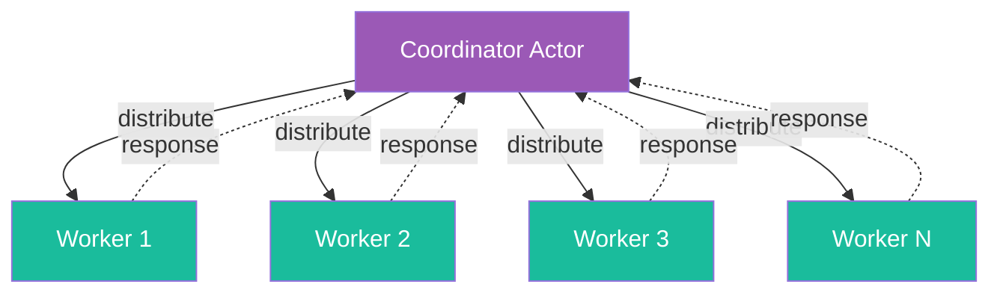

**Code Example:**

```rust
// Coordinator distributes work
let worker_ids = vec![worker1_id, worker2_id, worker3_id];
let mut next_worker = 0;

for task in tasks {
    let worker_id = worker_ids[next_worker];
    next_worker = (next_worker + 1) % worker_ids.len();  // Round-robin
    
    let (handler, rx) = get_response_handler();
    let msg = Message {
        payload: Some(task),
        stop: false,
        responder: Some(handler),
        blocking: None,
    };
    
    send_message_by_id(&mut actor_system, worker_id, msg).await?;
    responses.push(rx);  // Collect for later
}

// Wait for all responses
for rx in responses {
    let result = rx.await?;
    process_result(result);
}
```

**Use Cases:**

- Load balancing
- Parallel processing
- Task distribution
- Map-reduce patterns

## Channel Mechanics

### Buffered Channels

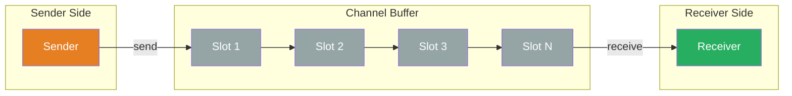

**Behavior:**

- **Buffer Not Full**: `send()` returns immediately
- **Buffer Full**: `send()` blocks (awaits) until space available
- **Default Size**: 100 messages (configurable)

**Configuration:**

```toml
[actor_system]
actor_buffer_size = 200  # Increase for high-throughput
```

### Backpressure

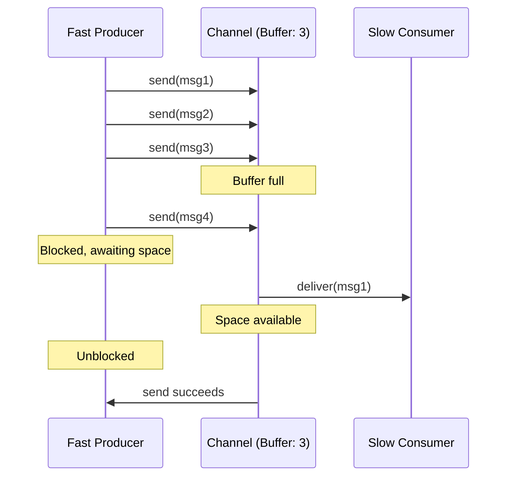

**Best Practices:**

- Size buffers based on message rates
- Monitor channel capacity in production
- Use async sends (don't block critical paths)
- Consider priority queues for critical messages

## Response Patterns

### ResponseHandler Pattern (Recommended)

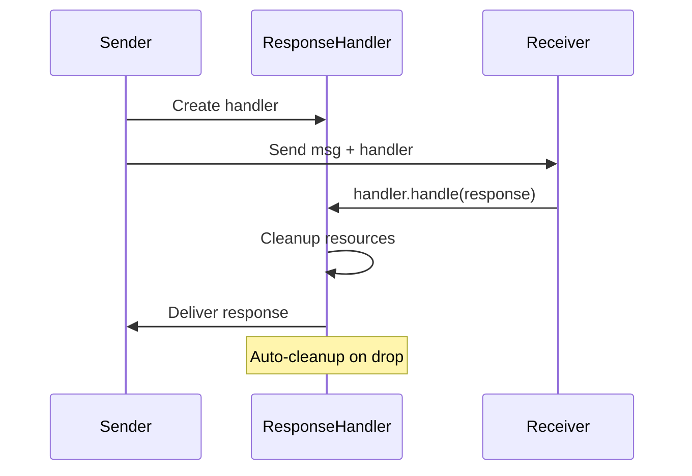

**Benefits:**

- Automatic resource cleanup
- No memory leaks
- Type-safe
- Composable

**Code:**

```rust
let (handler, rx) = get_response_handler::<ResponseMessage>();

// Handler automatically cleans up when dropped
// Even if response never arrives
```

### Oneshot Channel Pattern

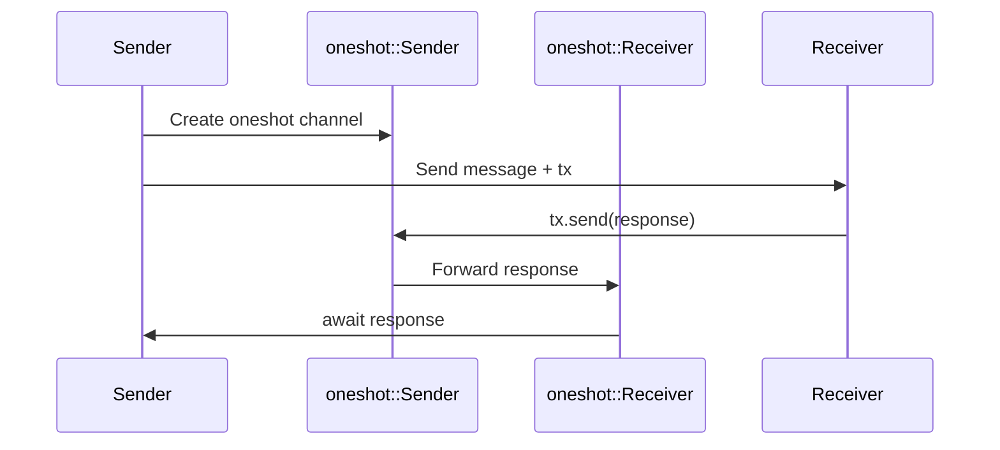

**When to Use:**

- Simple request-response
- Known fast response
- Testing/examples

**Limitations:**

- Manual cleanup needed
- Can leak if not awaited
- Not composable

### Blocking Channel Pattern

```mermaid
sequenceDiagram
    participant Sync as Sync Code
    participant Tx as mpsc::SyncSender
    participant Rx as mpsc::Receiver
    participant Actor as Async Actor

    Sync->>Tx: Create blocking channel
    Sync->>Actor: Send message + tx
    Actor->>Tx: tx.send(response)
    Note over Sync: Blocks thread
    Tx->>Rx: Deliver
    Rx->>Sync: rx.recv()
    Note over Sync: Unblocked
```

**When to Use:**

- Bridging sync/async boundaries
- Main function without async
- FFI interfaces

**Warning:**

- Blocks OS thread
- Can cause deadlocks
- Use sparingly

## Message Routing

### By ID (Direct)

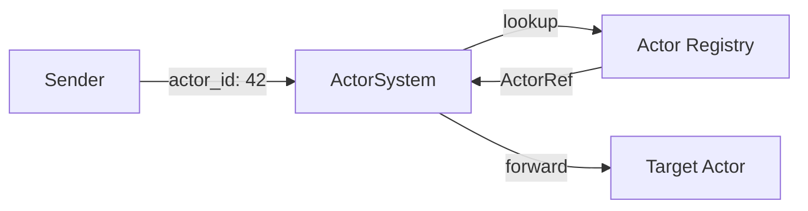

**Code:**

```rust
send_message_by_id(&mut actor_system, 42, message).await?;
```

**Characteristics:**

- O(1) lookup (HashMap)
- Fast and direct
- Requires knowing ID

### By Name (Indirect)

```mermaid
graph LR
    Sender[Sender]
    System[ActorSystem]
    NameMap[Name Map]
    Registry[Actor Registry]
    Actor[Target Actor]

    Sender -->|name: "worker"| System
    System -->|lookup name| NameMap
    NameMap -->|actor_id| System
    System -->|lookup id| Registry
    Registry -->|ActorRef| System
    System -->|forward| Actor
```

**Code:**

```rust
let actor_id = find_actor_by_name(&actor_system, "worker")?;
send_message_by_id(&mut actor_system, actor_id, message).await?;
```

**Characteristics:**

- Two-step lookup (name → ID → ActorRef)
- More flexible
- Useful for dynamic systems

### Using ActorRef (Cached)

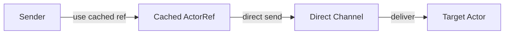

**Code:**

```rust
// Cache the ActorRef
let actor_ref = get_actor_sender(&actor_system, actor_id)?;

// Use repeatedly without lookups
for msg in messages {
    actor_ref.send(msg).await?;
}
```

**Characteristics:**

- Zero lookup overhead
- Best performance
- Must handle actor lifecycle

## Error Handling in Messages

### Send Errors

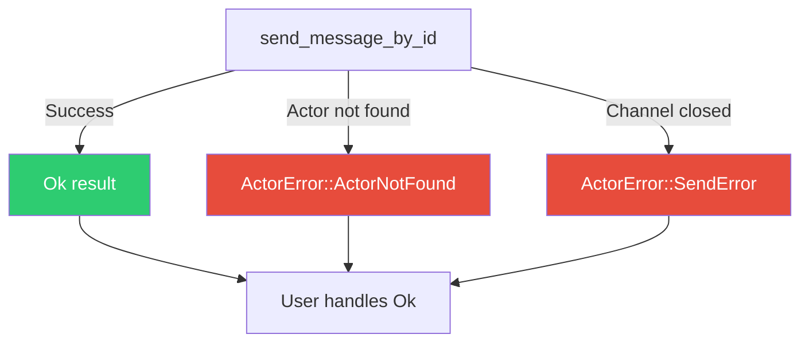

**Handling:**

```rust
match send_message_by_id(&mut actor_system, actor_id, msg).await {
    Ok(()) => println!("Message sent"),
    Err(ActorError::ActorNotFound(_)) => {
        eprintln!("Actor {} no longer exists", actor_id);
        // Handle gracefully
    }
    Err(ActorError::SendError(e)) => {
        eprintln!("Channel error: {}", e);
        // Retry or fail
    }
    Err(e) => eprintln!("Unexpected error: {:?}", e),
}
```

### Response Errors

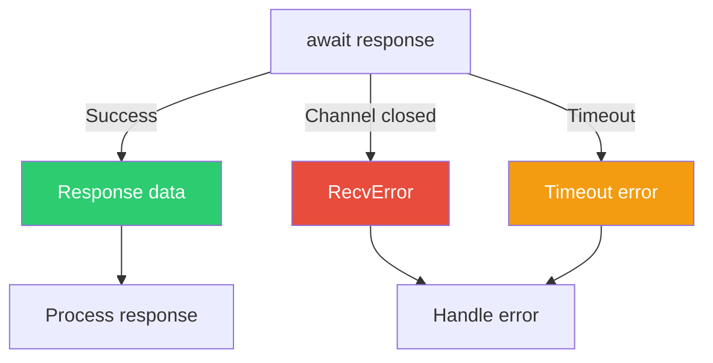

**Handling:**

```rust
match tokio::time::timeout(Duration::from_secs(5), rx).await {
    Ok(Ok(response)) => {
        // Got response
        process(response);
    }
    Ok(Err(_)) => {
        // Channel closed (actor died)
        eprintln!("Actor terminated before responding");
    }
    Err(_) => {
        // Timeout
        eprintln!("Response timeout");
    }
}
```

## Performance Considerations

### Message Size

- **Small messages**: Fast, low overhead
- **Large messages**: Consider Arc for sharing
- **Clone cost**: Affects throughput

```rust
// Bad: Clone large data
struct HugeMessage(Vec<u8>);  // 10MB

// Better: Share with Arc
struct SharedMessage(Arc<Vec<u8>>);  // Clone is cheap
```

### Batching

```rust
// Instead of many small messages
for item in items {
    send_message(item).await?;  // N round-trips
}

// Batch them
send_message(BatchMessage(items)).await?;  // 1 round-trip
```

### Async vs Concurrent

```rust
// Sequential (slow)
for actor_id in actors {
    send_message(actor_id, msg.clone()).await?;
}

// Concurrent (fast)
let futures: Vec<_> = actors
    .iter()
    .map(|&actor_id| send_message(actor_id, msg.clone()))
    .collect();
tokio::join_all(futures).await;
```

## Best Practices

1. **Use Fire-and-Forget** when possible (lowest latency)
2. **Cache ActorRefs** for repeated sends
3. **Batch messages** to reduce overhead
4. **Use ResponseHandler** for request-response
5. **Handle errors explicitly** (don't unwrap)
6. **Avoid blocking** in receive methods
7. **Size buffers appropriately** for workload
8. **Monitor message counts** in production
9. **Use timeouts** for responses
10. **Profile before optimizing** (measure don't guess)

## Anti-Patterns

❌ **Blocking in receive:**

```rust
fn receive(&mut self, msg: Message) {
    std::thread::sleep(Duration::from_secs(10));  // Blocks Tokio!
}
```

✅ **Use async sleep:**

```rust
async fn receive(&mut self, msg: Message) {
    tokio::time::sleep(Duration::from_secs(10)).await;  // Yields
}
```

❌ **Ignoring send errors:**

```rust
send_message(id, msg).await.ok();  // Silent failure
```

✅ **Handle errors:**

```rust
send_message(id, msg).await
    .unwrap_or_else(|e| eprintln!("Send failed: {}", e));
```

❌ **Leaking response channels:**

```rust
let (tx, rx) = oneshot::channel();
send_message(msg, tx).await?;
// Never await rx - leaks memory!
```

✅ **Always await or drop explicitly:**

```rust
let (handler, rx) = get_response_handler();
send_message(msg, handler).await?;
let response = rx.await?;  // Or drop(rx) if not needed
```

## Next Steps

- See [actor-lifecycle.md](actor-lifecycle.md) for actor state management
- See [streaming-architecture.md](streaming-architecture.md) for reactive patterns
- See [actor-critic-pattern.md](actor-critic-pattern.md) for ML coordination example
