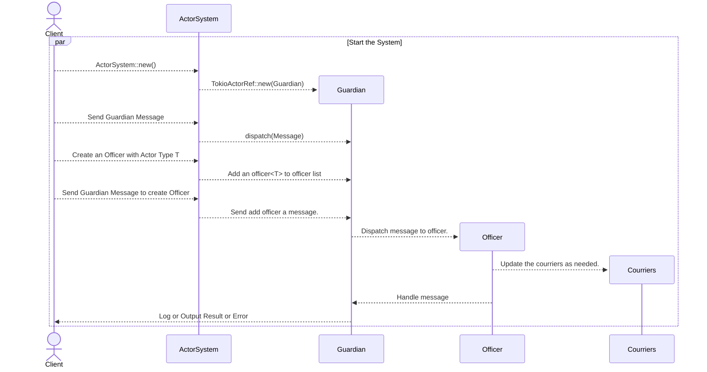

```mermaid

sequenceDiagram
actor Client
par Start the System
    Client -->> ActorSystem : ActorSystem::new()
    create participant Guardian
    ActorSystem -->> Guardian: TokioActorRef::new(Guardian)
    Client -->> ActorSystem: Send Guardian Message
    ActorSystem -->> Guardian: dispatch(Message)
    Client -->> ActorSystem : Create an Officer with Actor Type T
    ActorSystem -->> Guardian : Add an officer<T> to officer list
    Client -->> ActorSystem : Send Guardian Message to create Officer   
    ActorSystem  -->> Guardian : Send add officer a message.
    create participant Officer
    Guardian -->> Officer : Dispatch message to officer.
    create participant Courriers
    Officer -->> Courriers : Update the courriers as needed.
    Officer -->> Guardian : Handle message
    Guardian -->> Client : Log or Output Result or Error

end
    


```
