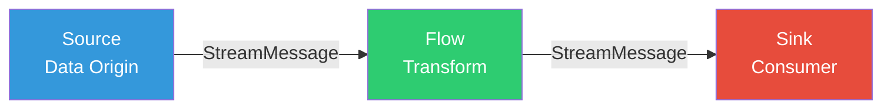
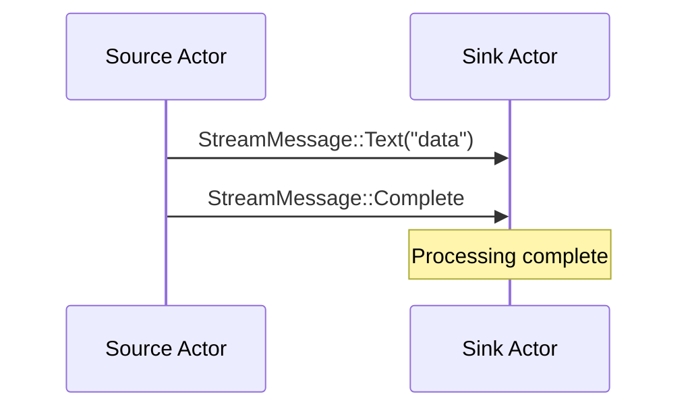
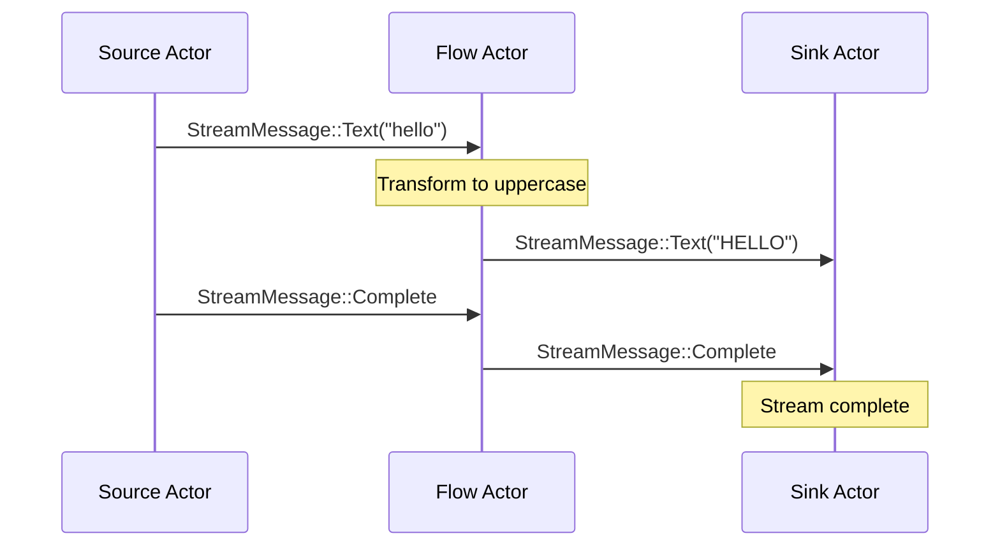
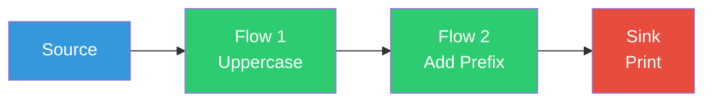
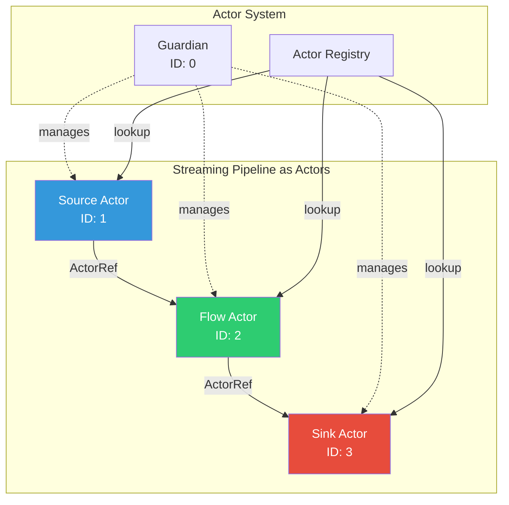
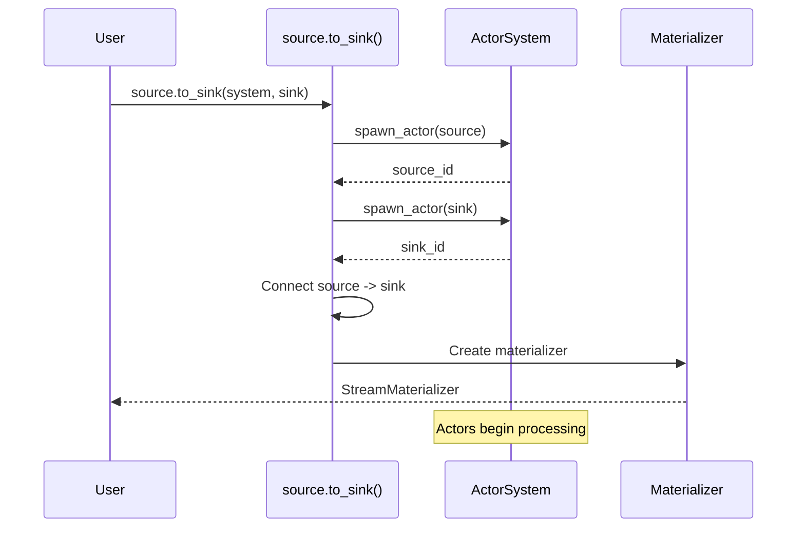
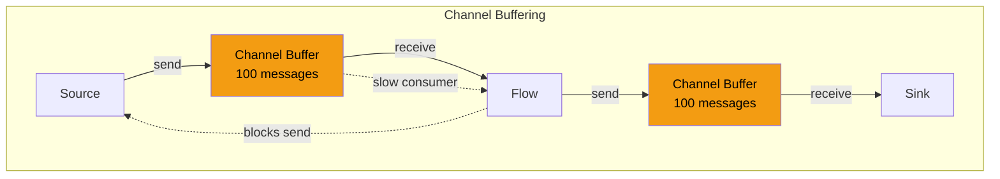
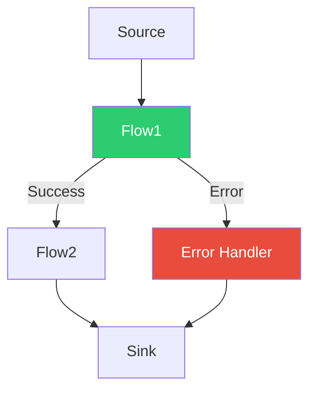

# Streaming Architecture

This document describes the reactive streaming system in SIDS, providing a dataflow programming model built on top of
the actor system.

## Overview

SIDS streaming provides a composable, backpressure-aware data processing pipeline inspired by Reactive Streams and
Akka Streams. The streaming module is **stable** as of v1.0.0.



**Key Concepts:**

- **Source**: Produces data into the stream
- **Flow**: Transforms data as it passes through
- **Sink**: Consumes final output
- **StreamMessage**: Typed message for stream data
- **Materializer**: Controls stream execution

## Core Components

### StreamMessage

Enum representing data flowing through the stream:

```rust
pub enum StreamMessage {
    Data(Vec<u8>),         // Binary data
    Text(String),          // Text data
    Complete,              // Stream completed successfully
    Error(String),         // Error occurred
}
```

**Terminal Messages:**

- `Complete` - Normal stream termination
- `Error` - Abnormal termination with error

### Source

Originates data into the stream.

```rust
pub struct Source<SourceType, Materializer> {
    mat: Materializer,
    data: Option<SourceType>,
}

// Create source
let source = Source::new("Hello, World!".to_string(), NotUsed);
```

**Source Types:**

- String source
- HTTP source (with `streaming` feature)
- File source
- Custom sources

### Flow

Transforms data passing through the stream.

```rust
pub struct Flow<F>
where
    F: Fn(StreamMessage) -> StreamMessage + Send + 'static,
{
    name: String,
    transform: F,
    downstream: Option<Sender<Message<StreamMessage, StreamMessage>>>,
}

// Create flow
let flow = Flow::new("UppercaseFlow".to_string(), |msg| {
    match msg {
        StreamMessage::Text(text) => StreamMessage::Text(text.to_uppercase()),
        other => other,
    }
});
```

### Sink

Terminal consumer of stream data.

```rust
pub struct Sink<F>
where
    F: Fn(StreamMessage) + Send + 'static,
{
    name: String,
    consumer: F,
    messages_received: Arc<Mutex<usize>>,
}

// Create sink
let sink = Sink::new("PrintSink".to_string(), |msg| {
    match msg {
        StreamMessage::Text(text) => println!("Received: {}", text),
        StreamMessage::Complete => println!("Stream completed!"),
        _ => {}
    }
});
```

## Stream Topology

### Simple: Source → Sink



**Implementation:**

```rust
let source = Source::new("Hello".to_string(), NotUsed);
let sink = Sink::new("PrintSink".to_string(), |msg| {
    if let StreamMessage::Text(text) = msg {
        println!("{}", text);
    }
});

let mut actor_system = start_actor_system();
let materializer = source.to_sink(&mut actor_system, sink).await;

// Wait for processing
tokio::time::sleep(Duration::from_millis(100)).await;
```

### Pipeline: Source → Flow → Sink



**Implementation:**

```rust
let source = Source::new("hello".to_string(), NotUsed);

let flow = Flow::new("UppercaseFlow".to_string(), |msg| {
    match msg {
        StreamMessage::Text(text) => StreamMessage::Text(text.to_uppercase()),
        other => other,
    }
});

let sink = Sink::new("PrintSink".to_string(), |msg| {
    if let StreamMessage::Text(text) = msg {
        println!("{}", text);
    }
});

let mut actor_system = start_actor_system();
let materializer = source.via_to_sink(&mut actor_system, flow, sink).await;
```

### Multi-Flow: Source → Flow₁ → Flow₂ → Sink



**Implementation:**

```rust
let flow1 = Flow::new("UppercaseFlow".to_string(), |msg| {
    match msg {
        StreamMessage::Text(text) => StreamMessage::Text(text.to_uppercase()),
        other => other,
    }
});

let flow2 = Flow::new("PrefixFlow".to_string(), |msg| {
    match msg {
        StreamMessage::Text(text) => StreamMessage::Text(format!(">>> {}", text)),
        other => other,
    }
});

// Chain flows using map
let combined_flow = flow1.map(move |msg| {
    match msg {
        StreamMessage::Text(text) => StreamMessage::Text(format!(">>> {}", text)),
        other => other,
    }
});
```

## Actor Implementation

Streaming components are implemented as actors:



### Source Actor

```rust
impl Actor<StreamMessage, StreamMessage> for Source<String, NotUsed> {
    async fn receive(&mut self, message: Message<StreamMessage, StreamMessage>) {
        // Source typically emits data on start
        if let Some(downstream) = &self.downstream {
            if let Some(data) = &self.data {
                // Send data
                let msg = Message {
                    payload: Some(StreamMessage::Text(data.clone())),
                    stop: false,
                    responder: None,
                    blocking: None,
                };
                let _ = downstream.send(msg).await;
                
                // Send completion
                let complete_msg = Message {
                    payload: Some(StreamMessage::Complete),
                    stop: false,
                    responder: None,
                    blocking: None,
                };
                let _ = downstream.send(complete_msg).await;
            }
        }
    }
}
```

### Flow Actor

```rust
impl<F> Actor<StreamMessage, StreamMessage> for Flow<F>
where
    F: Fn(StreamMessage) -> StreamMessage + Send + 'static,
{
    async fn receive(&mut self, message: Message<StreamMessage, StreamMessage>) {
        if let Some(payload) = message.payload {
            // Check for terminal messages
            if payload.is_terminal() {
                // Forward terminal messages unchanged
                if let Some(downstream) = &self.downstream {
                    let _ = downstream.send(Message {
                        payload: Some(payload),
                        stop: false,
                        responder: None,
                        blocking: None,
                    }).await;
                }
                return;
            }
            
            // Transform data
            let transformed = (self.transform)(payload);
            
            // Send downstream
            if let Some(downstream) = &self.downstream {
                let _ = downstream.send(Message {
                    payload: Some(transformed),
                    stop: false,
                    responder: None,
                    blocking: None,
                }).await;
            }
        }
    }
}
```

### Sink Actor

```rust
impl<F> Actor<StreamMessage, StreamMessage> for Sink<F>
where
    F: Fn(StreamMessage) + Send + 'static,
{
    async fn receive(&mut self, message: Message<StreamMessage, StreamMessage>) {
        if let Some(payload) = message.payload {
            // Increment counter
            *self.messages_received.lock().unwrap() += 1;
            
            // Consume data
            (self.consumer)(payload.clone());
            
            // Log if terminal
            if payload.is_terminal() {
                info!("Sink received terminal message");
            }
        }
    }
}
```

## Materializer

The materializer controls stream execution:

```rust
pub struct StreamMaterializer {
    source_id: u32,
    sink_id: u32,
    flow_id: Option<u32>,
}

impl StreamMaterializer {
    pub fn source_id(&self) -> u32 {
        self.source_id
    }
    
    pub fn sink_id(&self) -> u32 {
        self.sink_id
    }
    
    pub fn flow_id(&self) -> Option<u32> {
        self.flow_id
    }
}
```

**Materialization Process:**



## Data Flow Patterns

### Push Model

Data flows from source to sink:

```rust
// Source pushes data
source.emit("data") -> Flow -> Sink

// No pull/demand from downstream
```

### Backpressure

Handled by actor channel buffers:



**Backpressure Behavior:**

- Channels have finite buffer (default: 100)
- When full, send blocks until space available
- Provides natural flow control
- No special backpressure protocol needed

### Error Handling



**Error Propagation:**

```rust
let flow = Flow::new("SafeFlow".to_string(), |msg| {
    match msg {
        StreamMessage::Text(text) => {
            match text.parse::<i32>() {
                Ok(num) => StreamMessage::Text(format!("Number: {}", num)),
                Err(_) => StreamMessage::Error(format!("Invalid number: {}", text)),
            }
        }
        other => other,
    }
});

let sink = Sink::new("ErrorHandlingSink".to_string(), |msg| {
    match msg {
        StreamMessage::Text(text) => println!("Success: {}", text),
        StreamMessage::Error(err) => eprintln!("Error: {}", err),
        StreamMessage::Complete => println!("Done!"),
        _ => {}
    }
});
```

## Source Types

### String Source

```rust
let source = Source::new("Hello, World!".to_string(), NotUsed);
```

### HTTP Source

```rust
// Requires 'streaming' feature
match Source::from_url_text("https://api.example.com/data").await {
    Ok(source) => {
        // Use source in pipeline
    }
    Err(e) => {
        eprintln!("Failed to fetch: {:?}", e);
    }
}
```

### Multi-Item Source

```rust
let items = vec![
    "Item 1".to_string(),
    "Item 2".to_string(),
    "Item 3".to_string(),
];
let source = Source::from_items(items);  // Joins with newlines
```

### Custom Source

```rust
struct DatabaseSource {
    connection: DbConnection,
    query: String,
    downstream: Option<Sender<Message<StreamMessage, StreamMessage>>>,
}

impl Actor<StreamMessage, StreamMessage> for DatabaseSource {
    async fn receive(&mut self, _message: Message<StreamMessage, StreamMessage>) {
        if let Some(downstream) = &self.downstream {
            // Query database
            let results = self.connection.query(&self.query).await;
            
            // Emit each row
            for row in results {
                let msg = Message {
                    payload: Some(StreamMessage::Text(row)),
                    stop: false,
                    responder: None,
                    blocking: None,
                };
                let _ = downstream.send(msg).await;
            }
            
            // Signal completion
            let _ = downstream.send(Message {
                payload: Some(StreamMessage::Complete),
                stop: false,
                responder: None,
                blocking: None,
            }).await;
        }
    }
}
```

## Flow Transformations

### Map

```rust
let flow = Flow::new("MapFlow".to_string(), |msg| {
    match msg {
        StreamMessage::Text(text) => {
            StreamMessage::Text(text.to_uppercase())
        }
        other => other,
    }
});
```

### Filter

```rust
let flow = Flow::new("FilterFlow".to_string(), |msg| {
    match msg {
        StreamMessage::Text(text) if text.len() > 5 => {
            StreamMessage::Text(text)
        }
        StreamMessage::Text(_) => {
            StreamMessage::Error("Too short".to_string())
        }
        other => other,
    }
});
```

### FlatMap

```rust
// Expand one message into multiple (requires custom implementation)
struct FlatMapFlow {
    downstream: Option<Sender<Message<StreamMessage, StreamMessage>>>,
}

impl Actor<StreamMessage, StreamMessage> for FlatMapFlow {
    async fn receive(&mut self, message: Message<StreamMessage, StreamMessage>) {
        if let (Some(StreamMessage::Text(text)), Some(downstream)) = 
            (message.payload, &self.downstream) {
            
            // Split and emit multiple messages
            for word in text.split_whitespace() {
                let msg = Message {
                    payload: Some(StreamMessage::Text(word.to_string())),
                    stop: false,
                    responder: None,
                    blocking: None,
                };
                let _ = downstream.send(msg).await;
            }
        }
    }
}
```

### Batch

```rust
struct BatchFlow {
    batch_size: usize,
    buffer: Vec<String>,
    downstream: Option<Sender<Message<StreamMessage, StreamMessage>>>,
}

impl Actor<StreamMessage, StreamMessage> for BatchFlow {
    async fn receive(&mut self, message: Message<StreamMessage, StreamMessage>) {
        match message.payload {
            Some(StreamMessage::Text(text)) => {
                self.buffer.push(text);
                
                if self.buffer.len() >= self.batch_size {
                    if let Some(downstream) = &self.downstream {
                        let batch = self.buffer.join(", ");
                        self.buffer.clear();
                        
                        let _ = downstream.send(Message {
                            payload: Some(StreamMessage::Text(batch)),
                            stop: false,
                            responder: None,
                            blocking: None,
                        }).await;
                    }
                }
            }
            Some(StreamMessage::Complete) => {
                // Flush remaining
                if !self.buffer.is_empty() {
                    if let Some(downstream) = &self.downstream {
                        let batch = self.buffer.join(", ");
                        let _ = downstream.send(Message {
                            payload: Some(StreamMessage::Text(batch)),
                            stop: false,
                            responder: None,
                            blocking: None,
                        }).await;
                    }
                }
                
                // Forward completion
                if let Some(downstream) = &self.downstream {
                    let _ = downstream.send(Message {
                        payload: Some(StreamMessage::Complete),
                        stop: false,
                        responder: None,
                        blocking: None,
                    }).await;
                }
            }
            _ => {}
        }
    }
}
```

## Sink Types

### Console Sink

```rust
use sids::streaming::sink::consumers;

let sink = Sink::new("ConsoleSink".to_string(), consumers::print_console);
```

### Collector Sink

```rust
let (collector, storage) = consumers::create_collector();
let sink = Sink::new("CollectorSink".to_string(), collector);

// Later, access collected data
let collected = storage.lock().unwrap();
println!("Collected {} items", collected.len());
```

### Custom Sink

```rust
let sink = Sink::new("FileSink".to_string(), |msg| {
    if let StreamMessage::Text(text) = msg {
        let mut file = OpenOptions::new()
            .create(true)
            .append(true)
            .open("output.txt")
            .unwrap();
        
        writeln!(file, "{}", text).unwrap();
    }
});
```

## Performance Considerations

### Throughput

- **Actor overhead**: ~1-2 μs per message
- **Channel latency**: ~100-500 ns
- **Transform cost**: Depends on function complexity

### Memory

- **Buffer size**: 100 messages per channel (default)
- **Message size**: StreamMessage enum + payload
- **Backpressure**: Automatic via bounded channels

### Optimization

```rust
// 1. Use Arc for large data
let big_data = Arc::new(vec![0u8; 1_000_000]);
let flow = Flow::new("Process".to_string(), move |msg| {
    let data = big_data.clone();  // Cheap Arc clone
    // Process...
});

// 2. Batch small messages
let batch_flow = create_batch_flow(100);  // Batch 100 items

// 3. Parallel flows (fan-out/fan-in pattern)
// Split -> Process in parallel -> Merge
```

## Integration with Actor System

Streaming components are regular actors:

```rust
// Can stop streaming components
stop_actor(&mut system, materializer.source_id()).await?;

// Can list streaming actors
let actors = list_actors(&system);
for (id, name) in actors {
    println!("Actor {}: {}", id, name);
}

// Can send messages directly
send_message_by_id(
    &mut system,
    materializer.sink_id(),
    Message {
        payload: Some(StreamMessage::Text("Direct message".into())),
        stop: false,
        responder: None,
        blocking: None,
    }
).await?;
```

## Best Practices

1. **Use terminal messages** - Always send `Complete` or `Error` to signal end
2. **Handle backpressure** - Don't spawn unlimited sources
3. **Keep transforms pure** - Avoid side effects in Flow functions
4. **Error handling** - Convert errors to `StreamMessage::Error`
5. **Resource cleanup** - Stop streams when done
6. **Monitoring** - Use materializer IDs to track stream actors
7. **Testing** - Use collector sinks to verify output
8. **Composition** - Build complex streams from simple components

## Common Patterns

### Fan-Out (Broadcast)

```rust
// One source, multiple sinks
let source = Source::new("data".to_string(), NotUsed);
let sink1 = Sink::new("Sink1".to_string(), consumers::print_console);
let sink2 = Sink::new("Sink2".to_string(), |msg| { /* different consumer */ });

// Need custom implementation to clone messages
```

### Fan-In (Merge)

```rust
// Multiple sources, one sink
// Requires custom merge actor
```

### Pipeline Chaining

```rust
let result = source
    .via(flow1)
    .via(flow2)
    .via(flow3)
    .to(sink);
```

## Next Steps

- See [message-flow.md](message-flow.md) for actor communication patterns
- See [system-overview.md](system-overview.md) for ActorSystem architecture
- See [actor-lifecycle.md](actor-lifecycle.md) for actor state management
