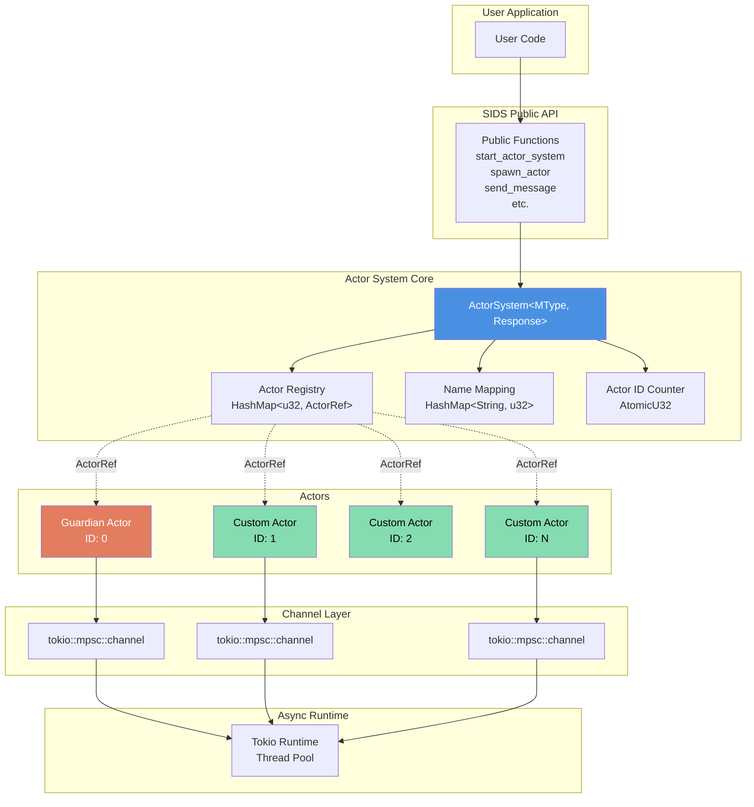
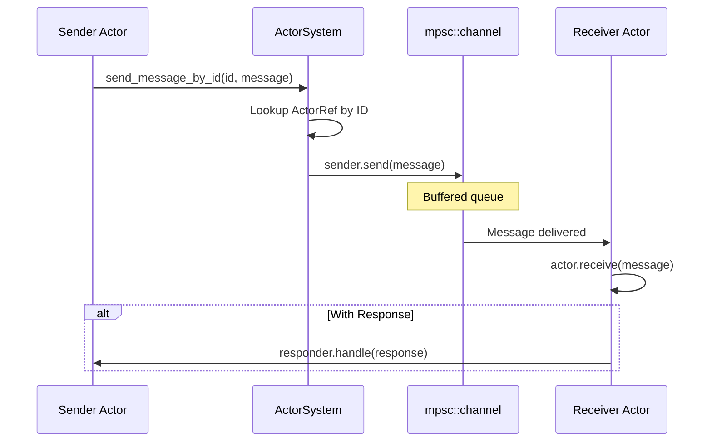
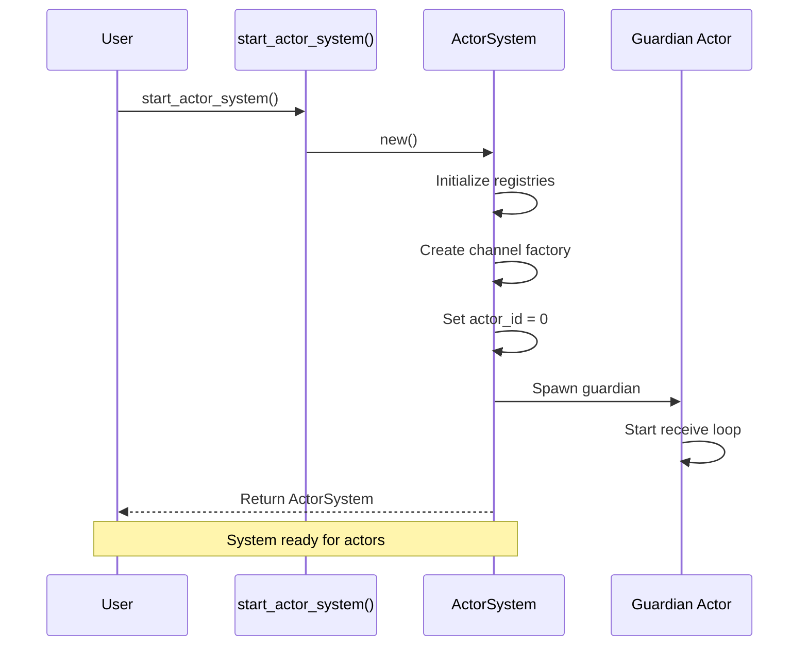
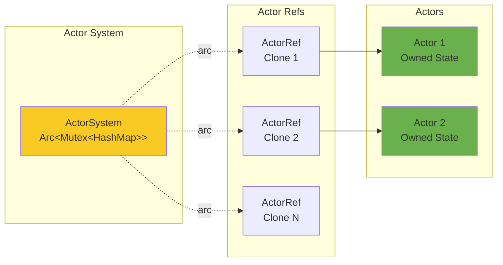
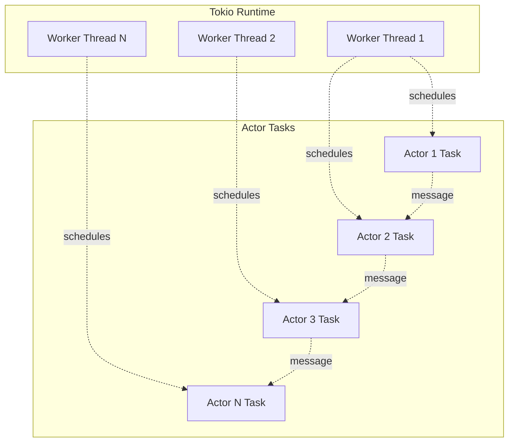
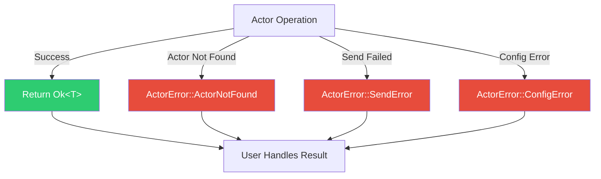
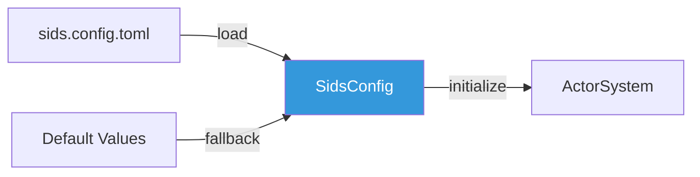
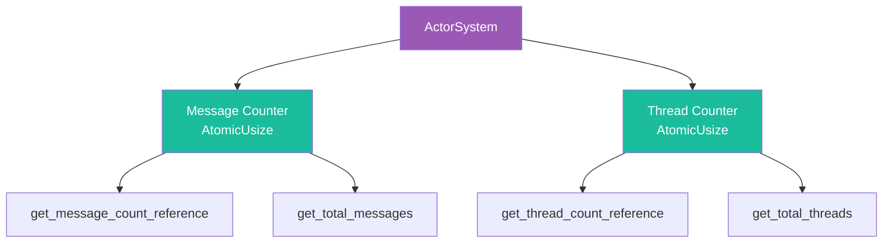

# System Architecture Overview

This document provides a high-level overview of SIDS architecture and core components.

## High-Level Architecture



## Core Components

### 1. ActorSystem

The central coordinator managing all actors and system state.

**Responsibilities:**

- Actor registration and ID assignment
- Name-to-ID mapping
- Message routing
- Channel creation
- System monitoring (message/thread counts)

**Key Fields:**

```rust
pub struct ActorSystem<MType, Response> {
    actor_refs: Arc<Mutex<HashMap<u32, ActorRef<MType, Response>>>>,
    actor_names: Arc<Mutex<HashMap<String, u32>>>,
    next_actor_id: Arc<AtomicU32>,
    channel_factory: Arc<ChannelFactory<MType, Response>>,
    // ... monitoring fields
}
```

**Thread Safety:**

- Uses `Arc` for shared ownership
- `Mutex` for synchronized access to collections
- `AtomicU32` for lock-free ID generation

### 2. Actor Trait

Defines the behavior interface all actors must implement.

```rust
#[async_trait]
pub trait Actor<MType, Response>: Send + 'static {
    async fn receive(&mut self, message: Message<MType, Response>);
}
```

**Key Properties:**

- `Send`: Can be transferred between threads
- `'static`: No borrowed references (owned data only)
- `async`: Non-blocking message processing

### 3. ActorRef

A reference (handle) to an actor for sending messages.

```rust
pub struct ActorRef<MType, Response> {
    sender: Sender<Message<MType, Response>>,
    actor_id: u32,
}
```

**Capabilities:**

- Send messages to actor
- Non-blocking (buffered channel)
- Clone-able (multiple references to same actor)

### 4. Message

The message envelope carrying data and metadata.

```rust
pub struct Message<MType, Response> {
    pub payload: Option<MType>,
    pub stop: bool,
    pub responder: Option<BoxedResponseHandler<Response>>,
    pub blocking: Option<()>,
}
```

**Fields:**

- **payload**: User-defined message data
- **stop**: Signal to terminate actor
- **responder**: Optional response handler
- **blocking**: Hint for synchronous processing

### 5. Guardian Actor

Special actor (ID 0) automatically spawned with every system.

**Purpose:**

- System heartbeat (responds to ping)
- Default message receiver
- System initialization

## Component Interactions

### Actor Creation Flow

```mermaid
sequenceDiagram
    participant User
    participant API as Public API
    participant System as ActorSystem
    participant Runtime as Tokio
    participant Actor

    User->>API: spawn_actor(system, actor, name)
    API->>System: spawn_actor(actor, name)
    System->>System: Generate actor ID
    System->>Runtime: tokio::spawn(async task)
    Runtime->>Actor: Start receive loop
    System->>System: Store ActorRef in registry
    System->>System: Map name -> ID
    System-->>User: Actor spawned (ID assigned)
```

### Message Sending Flow



## System Startup Sequence



## Memory Model

### Ownership



**Key Points:**

- Each actor owns its state (no shared memory)
- `ActorRef` clones allow multiple senders
- System holds authoritative registry
- Channels provide message isolation

## Concurrency Model

### Threading



**Characteristics:**

- Actors run as independent async tasks
- Tokio schedules tasks across thread pool
- No locks needed for actor state (isolated)
- Message channels handle synchronization

## Error Handling



All public APIs return `ActorResult<T>` allowing proper error handling with `?` operator.

## Configuration



**Configurable Parameters:**

- Actor buffer size (channel capacity)
- Shutdown timeout
- Custom system settings

## Monitoring



Real-time monitoring via atomic counters (lock-free reads).

## Design Trade-offs

### Strengths

- **Type Safety**: Compile-time guarantees via Rust type system
- **Memory Safety**: No data races, no memory leaks (RAII)
- **Performance**: Lock-free where possible, efficient async
- **Scalability**: Linear scaling with cores

### Trade-offs

- **Single Message Type**: All actors use same `MType` (use enums for variety)
- **No Actor Hierarchy**: Flat structure (supervision optional)
- **Local Only**: No built-in distributed actors (v1.0)
- **Tokio Dependent**: Tied to Tokio async runtime

## Comparison with Other Frameworks

| Feature | SIDS | Actix | Tokio Actors |
| ------- | ---- | ----- | ------------ |
| Type Safety | Strong | Strong | Strong |
| Message Types | Single (enum-based) | Multiple | Flexible |
| Supervision | Optional | Built-in | Manual |
| Streaming | First-class | Via Actix-web | Manual |
| Learning Curve | Low | Medium | Low |
| Production Ready | v1.0+ | Yes | DIY |

## Next Steps

- See [message-flow.md](message-flow.md) for detailed message passing patterns
- See [actor-lifecycle.md](actor-lifecycle.md) for actor state transitions
- See [streaming-architecture.md](streaming-architecture.md) for reactive streams
